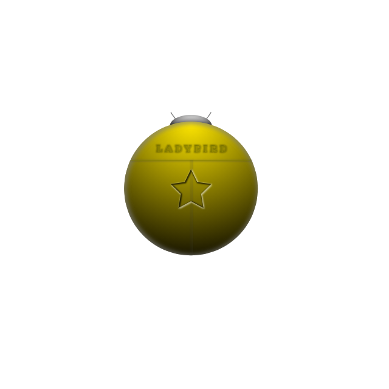

# Ladybird

RISC-V processor; written in System Verilog

* Spec. Ladybird Asterisk-Ena
  * In-Order, tiny scalar processor
  * RV32I only
  * Not pipelined, basic 5 stages
  * Embedded memory mapped I/Os (GPIO/UART)
  * Target is [ARTY-S7](https://digilent.com/reference/programmable-logic/arty-s7/start).
